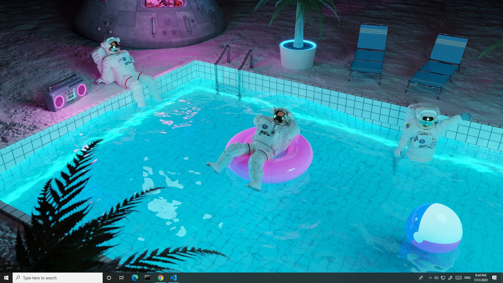

# Reddit-Api-wallpaper
If you are like me too board of your background image, and not sure what to change it to, use this simple python script. It basically scrapes wallpaper and wallpapers subreddits for the hottest images, and place them as the desktop background image. It works only on windows. I would also recommend using a task scheduler that comes with every Windows 10, to run the program every 12 hours or whenever you like (I run it every hour).

## To run Reddit-Api-wallpaper:
type "python Reddit-Api-wallpaper" on this file directry or double click on Reddit-Api-wallpaper file icon:

My current background image:

